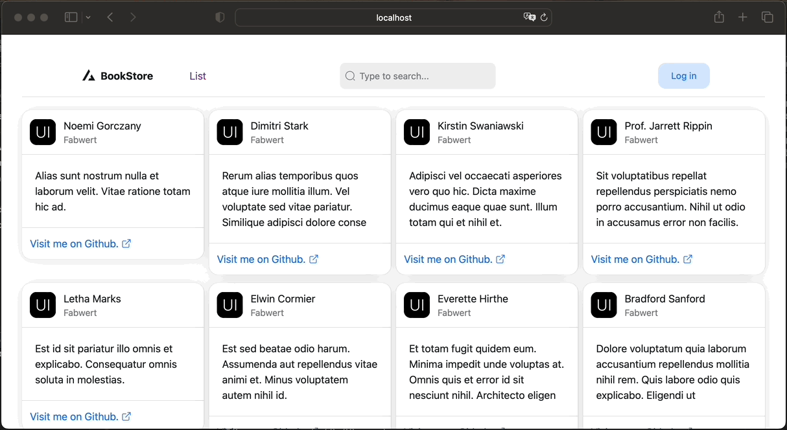

# react-laravel-books
 React (Vite Typescript), Redux, Laravel




## Client

To install dependencies, execute the following commands:
```shell
$ npm install
```
or
```shell
$ yarn install
```

To run the development server, use one of the following commands:
```shell
$ npm run dev
```
or
```shell
$ yarn dev
```

## Server

For server-side operations, begin by installing the necessary dependencies:
```shell
$ composer install
```

To create and populate the database, run the following command:
```shell
$ php artisan migrate:fresh --seed
```

Finally, initiate the server with the following command:
```shell
$ php artisan serve
```
